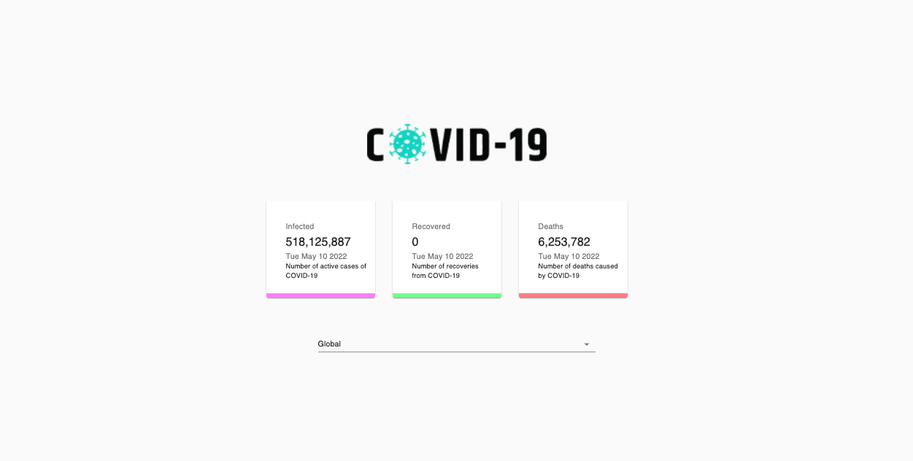
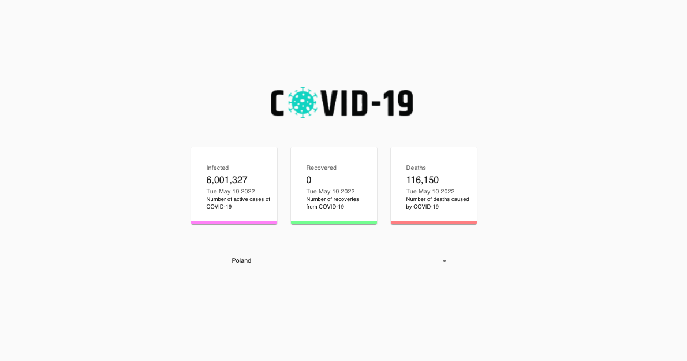
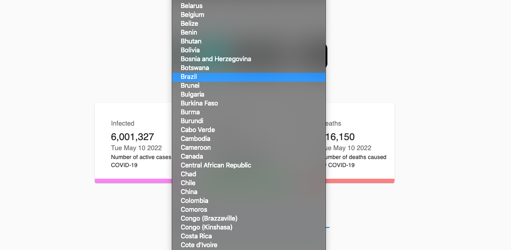
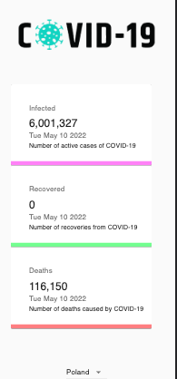

Giveaway website

Purpose of the project was creating simple Coronavirus(Covid-19) data tracking app with using REST API in React.

## Table of Contents

* [General Info](#general-information)
* [Technologies Used](#technologies-used)
* [Screenshots](#screenshots)
* [Setup](#setup)
* [Project Status](#project-status)
* [Room for Improvement](#room-for-improvement)
* [Contact](#contact)

## General Information

- The app is showing live data of fundamental COVID-19 details such as Global COVID-19 stats.
- Number of cases in particular countries
- With use of external API app display data of infected, recovered and deaths people.
- Application is responsive for mobile devices.
- Unfortunately API that I've used stopped showing data of Recovered people.

## Technologies Used

-HTML -CSS -REACT(hooks,effects)
-API(rest,fetch,async/await syntax)
-MATERIAL UI

## Screenshots

## Setup

- download or clone repository / `git clone repo_address`
- install dependencies / `npm install`
- start app by `npm start`

## Project Status

Project is: completed.

[//]: # (Assumed learning task completed.)

## Room for Improvement

- I would like to implement charts which are displaying statistics.

## Contact

Created by [_Duckjaniels_](https://www.linkedin.com/in/maksym-kaczorowski-008b3a154/) - feel free to contact me!